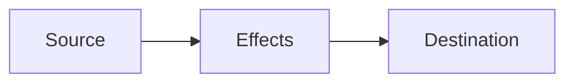
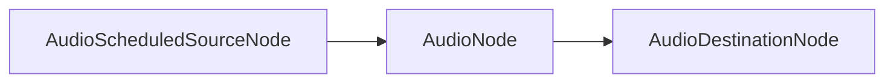

## Web Audio API 
### Workshop

Becky Brown & Laurens Inauen

---

### Plan

1. Introduction with slides
	1. What is an API?
	2. What is the Web Audio API?
	3. Why should we care?
	4. How does it work?
2. Coding
3. ...
4. Profit

---
### What is an API?

- stands for **Application Programming Interface**
- defines the **interface** through which we can interact with a piece of software (library, server etc.)
- hides a complex problem (i.e., doing 3D graphics, network programming, etc) behind a set of higher-level functions
- generally accessed through a parent object that groups all functions for a single API

---

### What are Browser APIs?

- Expose browser features and native functionality to Javascript
- Are discussed and approved by the W3C Working Groups, and are expected to be implemented **by each browser**
- The spec often leaves room for interpretation -> inconsistencies in implementations
- W3C Working Groups are people with opinions and preferences

---

### Browser API examples

- DOM API (essential: manipulate page contents!)
- Fetch API (make requests for fetching external data)
- Canvas and WebGL APIs (2D/3D drawing)
- Web MIDI API

Full list available at: [https://developer.mozilla.org/en-US/docs/Web/API](https://developer.mozilla.org/en-US/docs/Web/API)

---

### Third-party libraries

- p5.js
- three.js
- Tone.js

built on top of browser APIs.

---

### What is the Web Audio API?

The Web Audio API is a **Browser API** for playing and manipulating audio, which can incorporate:
- oscillators
- samples
- audio effects
- recording
- user interactions
- visualization

---

### Original intentions

![[w3c-waapi-intention.png]]

---
### A troubled past...

The Web Audio API is controversial in quite a few ways:
- some people disagree with the spec
- Chrome shipped some of their own spec without [proper review](https://github.com/WebAudio/web-audio-api/issues/248#issuecomment-740698581)
- there are some fundamental problems (scheduling, buffer-size, fft etc.)
	- some limits come from the browser
	- some limits come from the spec
- what is it? who is it for? 

---

### What it isn't...

- collection of audio primitives (no `+`, no `*` etc.)
- a low-level audio framework, there's a lot of abstraction
- a high-level audio framework, there shouldn't be a node for everything 

---
### What it feels like...

- a semi-random collection of functionality
- a mixed bag between some low-level and high-level functionality
- doesn't really know its target audience (people who use FMOD)
---
### Why should we care?

- The WAAPI is a **browser API**, meaning browsers will continue to support it as long as it continues to be in the W3C spec. It will not change for the next 15 years. Backwards compatibility will always be guaranteed
- **Third-party libraries**, like Tone.js can disappear, if their developers have no time to maintain them
---
### Why should we care?

- Every library is based on Web Audio API. If there's something not available to you in Tone.js, p5.sound, etc., these libraries include a way to add WAAPI functionality via custom nodes
- Most libraries have a strong focus on traditional music, this isn't ideal for every use case
- For small projects p5.js or Tone.js can be overkill
- It is relatively simple and there are efforts to make [non-browser implementations](https://github.com/orottier/web-audio-api-rs)
- Limitation can be good
---
### Basics: the audio graph


Node based graph with sources, effects and destinations.

---



---

![[threads.png]]

Runs in a separate thread, or else it could be blocked by the UI (main) thread. Every Node has an internal _native_ representation.

___

### Audio Context

```js
const ctx = new AudioContext();
```

- represents a graph
- is responsible for creating nodes
- is responsible for processing audio
- provides the audio destination: `ctx.destination`
- provides the current time: `ctx.currentTime`

---
### AudioNode

Is the base interface for all audio nodes.

[details](https://developer.mozilla.org/en-US/docs/Web/API/AudioNode)

---

### AudioScheduledSourceNode

Is the base interface for all audio source nodes that can be scheduled.

[details](https://developer.mozilla.org/en-US/docs/Web/API/AudioScheduledSourceNode)

---
### Sources: Oscillator

```js
// create web audio api context
const ctx = new AudioContext();

// create OscillatorNode factory
const oscillator = ctx.createOscillator();

oscillator.type = "square";
oscillator.frequency.setValueAtTime(440, audioCtx.currentTime); // value in hertz
oscillator.connect(ctx.destination);
oscillator.start();
```

---
### Sources: Single-use

```js
const oscillator = ctx.createOscillator();
oscillator.start();
// --- a bit later
oscillator.stop();
// --- a bit later
oscillator.start();
```

This isn't possible. Sources are single-use. They are cheap to create and should/can not be reused.  When they finish they can be garbage-collected, short-term garbage-collection is less expensive than long-term garbage-collection.

---
### Sources: Samples

* `AudioBuffer`: holds a loaded sample in memory, sticks around
* `AudioBufferSourceNode`: plays the `AudioBuffer`, dies immediately after
* [involves buffer format conversion](https://developer.mozilla.org/en-US/docs/Web/API/Web_Audio_API/Basic_concepts_behind_Web_Audio_API#planar_versus_interleaved_buffers)

---
### Sources: Samples

```js
// load all sounds
let samples = [];

const paths = ["path1.wav", "path2.wav"];
const soundPromises = paths.map((path) =>
  fetch(path)
    .then((response) => response.arrayBuffer())
    .then((buffer) => ctx.decodeAudioData(buffer))
);

// allows parallel I/O
Promise.all(soundPromises).then((buffers) => {
  samples = buffers;
});
```

---
### Sources: Samples

`AudioBuffer` (memory) vs `AudioBufferSourceNode` (playback)

```js
// play one sound back
const track = ctx.createBufferSource();
track.buffer = samples[0];
track.connect(ctx.destination);
track.start(ctx.currentTime);
```

---
### AudioParams

Is the base interface for adjustable values.

[details](https://developer.mozilla.org/en-US/docs/Web/API/AudioParam)

---
### Adjusting: AudioParams

```js
oscillator.frequency.setValueAtTime(440, audioCtx.currentTime);
oscillator.frequency.linearRampToValueAtTime(440, audioCtx.currentTime + 2);
oscillator.frequency.value = 440; // low internal priority
```

* audio-rate (a-rate): happens for every individual sample frame
* control-rate (k-rate): happens on each block of 128 frames

---
### Adjusting: AudioParams

```js
const gain = ctx.createGain();
gain.gain.setValueAtTime(0, ctx.currentTime);

gain.gain.linearRampToValueAtTime(1, ctx.currentTime + 2);
gain.gain.linearRampToValueAtTime(0.5, ctx.currentTime + 3);
```

[What happens here?](https://github.com/WebAudio/web-audio-api/issues/573#issuecomment-151032325) 

---
### Effects: Gain

```js
const oscillator = ctx.createOscillator();
const gain = ctx.createGain();
gain.gain.setValueAtTime(0, ctx.currentTime);
gain.gain.value = 0.2; // is possible but will always be overwritten by setValue...

oscilator.connect(gain);
gain.connect(ctx.destination);
```

---
### Scheduling

```js
oscillator.start(ctx.currentTime + 1); // time in seconds
oscillator.stop(ctx.currentTime + 3);
```

Scheduling is fire and forget. The only way to prevent this from playing is to stop the context.

---
### Scheduling

- fine for some applications
- fatal for other applications (transport, sequencer etc.)
- no perfect solution: [Tale Of Two Clocks](https://web.dev/audio-scheduling/)

Take Away: You need a transport, you use a [library](https://github.com/felixroos/zyklus)

---
### AudioWorklet

```js
class Passthrough extends AudioWorkletProcessor {

  process(inputs, outputs, parameters) {
    const input = inputs[0];
    const output = outputs[0];
    for (let channel = 0; channel < input.length; ++channel) {
      const inputChannel = input[channel];
      const outputChannel = output[channel];
      for (let i = 0; i < inputChannel.length; ++i) {
        outputChannel[i] = inputChannel[i];
      }
    }
    
    return true;  
  }
}
```

---
### AudioWorklet

- replaced ScriptProcessorNode
- is the low-level interface many have been waiting for
- is where we can write custom DSP code
- is still limited in some ways, e.g. block size

---
## Coding Time

---
### Additional resources

[I don't know who the Web Audio API is designed for](https://blog.mecheye.net/2017/09/i-dont-know-who-the-web-audio-api-is-designed-for/)

---
